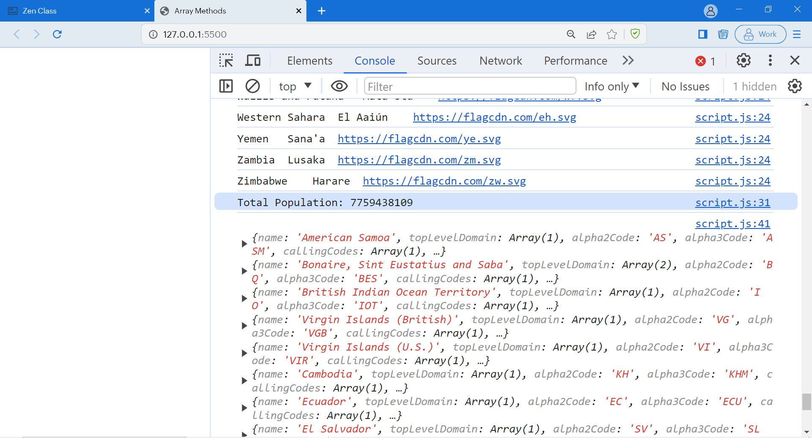

# JavaScript Day-7 Activity - ARRAY METHODS

1. Solving problems using array functions on rest countries data (https://restcountries.com/v3.1/all).

| Activity | Solution |
| :------: | :------: |
|a. Get all the countries from Asia continent /region using Filter function | [Solution](https://github.com/manoharsena/DAY-7/blob/master/script.js)|
|b. Get all the countries with a population of less than 2 lakhs using Filter function | [Solution](https://github.com/manoharsena/DAY-7/blob/master/script.js)|
|c. Print the following details name, capital, flag, using forEach function | [Solution](https://github.com/manoharsena/DAY-7/blob/master/script.js)|
|d. Print the total population of countries using reduce function | [Solution](https://github.com/manoharsena/DAY-7/blob/master/script.js)|
|e. Print the country that uses US dollars as currency. | [Solution](https://github.com/manoharsena/DAY-7/blob/master/script.js)|

